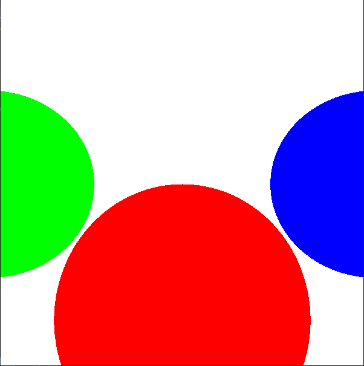
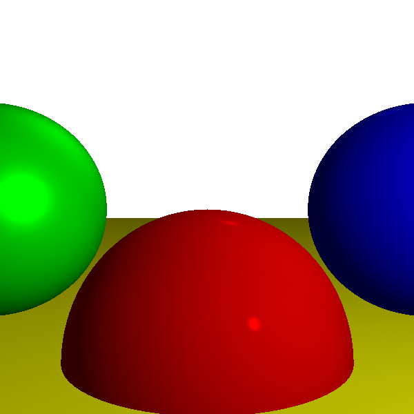
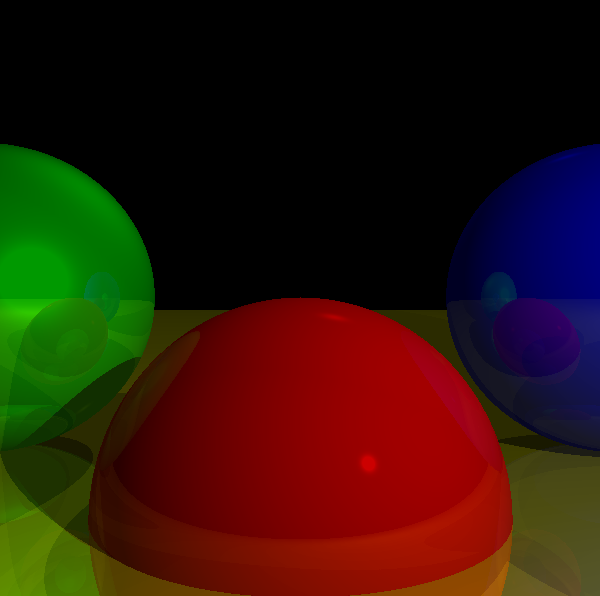

# Computer Graphics from Scratch
I documented my learning through a [book](https://www.amazon.com/Computer-Graphics-Scratch-Gabriel-Gambetta/dp/1718500769?crid=QCM4O34NIR6Y&dib=eyJ2IjoiMSJ9.x7eO19Tr0fe3BfcvaqhwC6v9bABJ2aSF96vvnz6kdSe2RHSiDaSd34EhXYoEQk8krSsxwz5V2PvnmM8SPVcJxZ8oU9OqDyJo_qk1WvtPLRFNrmzL1wLSLmJPozqrA58gPmM7PYFGYKGGYNH2ZL0WUJhS6PJvZPYHTaYnZrXRsfPx57d3gwJvV89iO47-lVAg0uhWaCFlNAKx1TkL6Pe11idM8-HBPezdC_Q7LZJRirk.kl0ggCg98K37k12U2j8lQORKJsUFz50_IqDkPMRRAZs&dib_tag=se&keywords=Computer+Graphics+from+Scratch&qid=1736454332&sprefix=computer+graphics+from+scratch%2Caps%2C642&sr=8-1), where every pseudocode or chapter summary is implemented with SFLM 3.0.0 by myself.

## Chapter 1
Project is on branch `chapter1`
To build project I did use the below command, where in my `C:/` path I have SFML installed. The full code is in main.cpp and src/sphere folder.
```
g++ -o main.exe main.cpp src/sphere/sphere.cpp src/light/light.cpp -I include -I C:/SFML/include -L C:/SFML/lib -lsfml-graphics -lsfml-window -lsfml-system
```
The results of the implementation can be found on below picture


## Chapter 2
Project is on branch `chapter2`
The project evolved into more complex project with a the following build command:
```
g++ -o main.exe main.cpp src/sphere/sphere.cpp src/light/light.cpp -I include -I C:/SFML/include -L C:/SFML/lib -lsfml-graphics -lsfml-window -lsfml-system
```

The results of light & reflection implementation are shown below


## Chapter 3
Project is on branch `chapter3`
The project uses the same build function like `chapter2`:
```
g++ -o main.exe main.cpp src/sphere/sphere.cpp src/light/light.cpp -I include -I C:/SFML/include -L C:/SFML/lib -lsfml-graphics -lsfml-window -lsfml-system
```

The results of the shadows & sphere reflection are shown below with reflection depth = 3
